  

## Transmission

Welcome to the grid. I am Michael Mardahl, a Microsoft MVP in Security, endpoint management nerd, automation builder, and community contributor.

I publish tools, notes, scripts, and field-tested ideas for people keeping modern Microsoft environments secure, manageable, and slightly less haunted.

## Signal Sources

| Channel | Link |
| --- | --- |
| Personal blog | [iphase.dk](https://iphase.dk) |
| Team field notes | [MSEndpointMgr Blog](https://www.msendpointmgr.com) |
| Microsoft MVP profile | [Security MVP: Michael Mardahl](https://mvp.microsoft.com/en-us/PublicProfile/5004117?fullName=Michael%20Mardahl) |
| Useful fragments | [Gists from the grid](https://gist.github.com/mardahl) |

## System Telemetry

  

